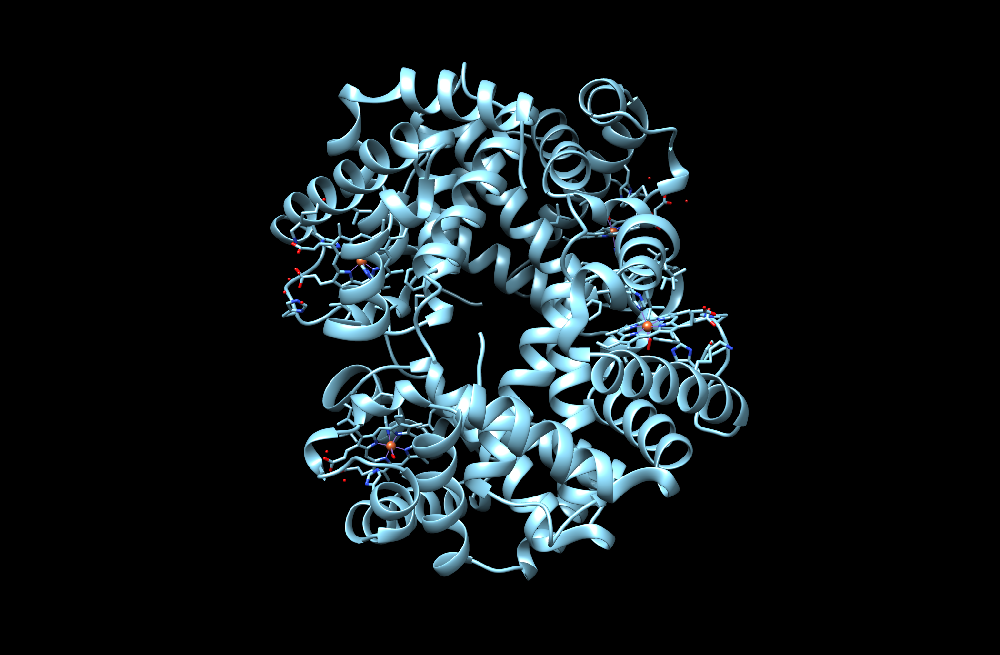
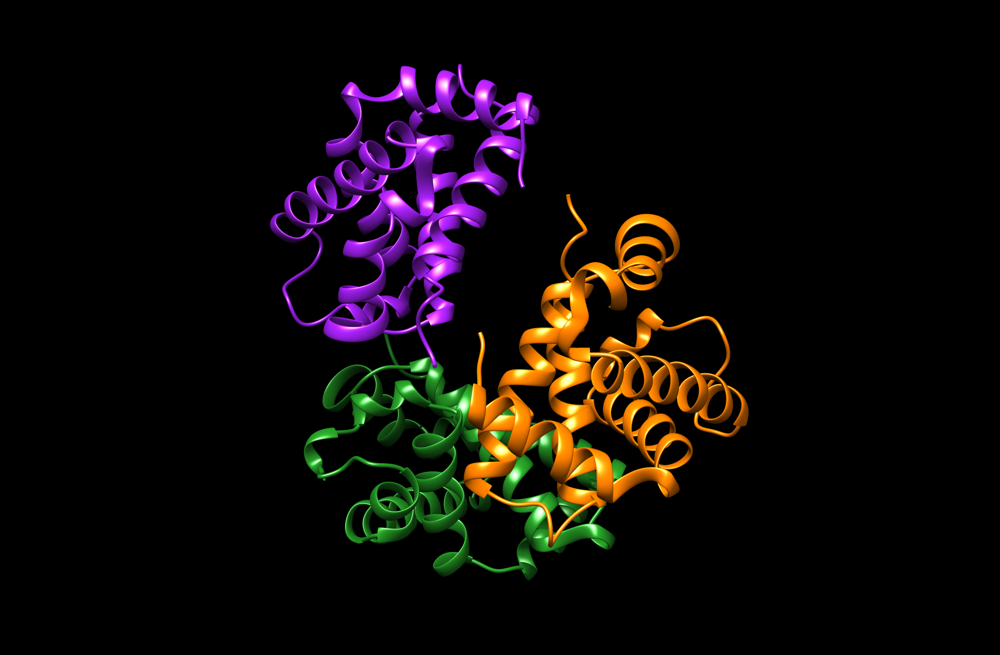
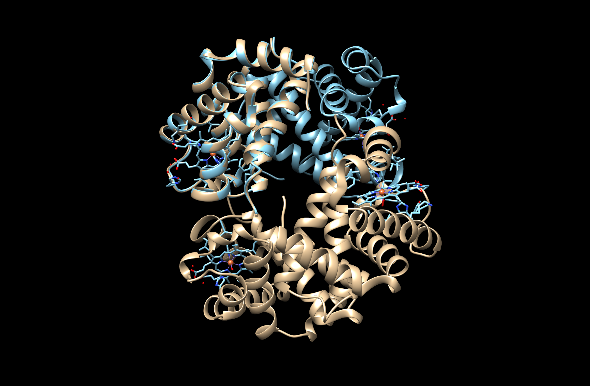
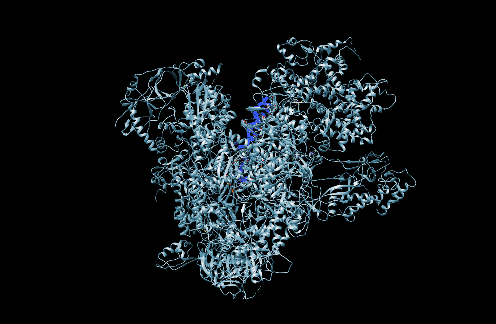
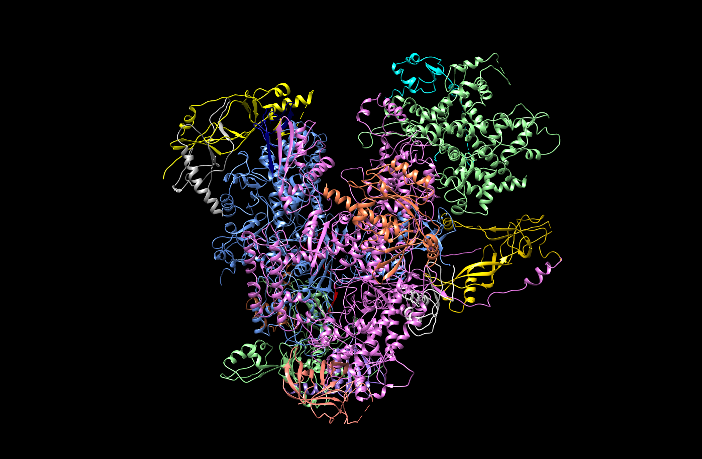
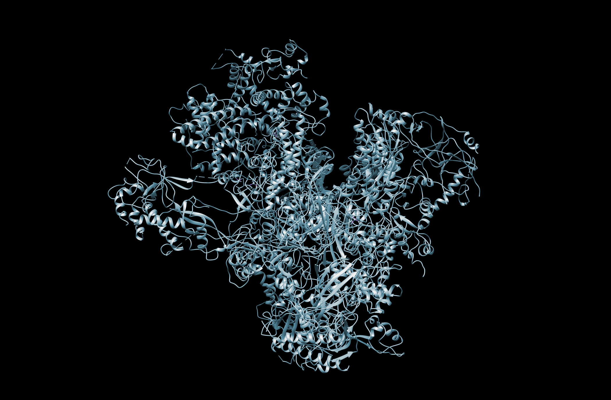
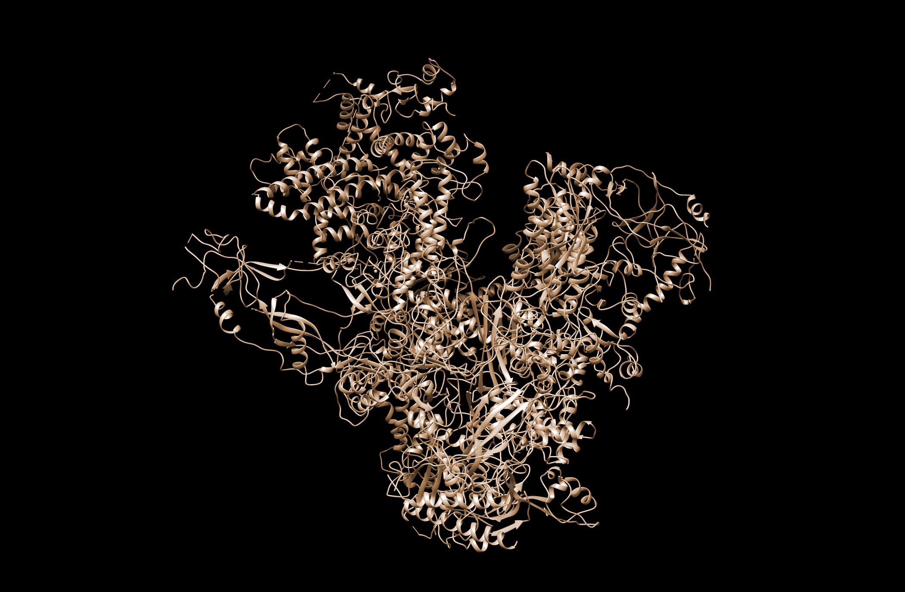

# Reconstructing macrocomplexes

*by Irene Agustí Barea and Marta Espinosa Camarena*

## **TABLE OF CONTENTS**

<!-- TOC depthFrom:1 depthTo:6 withLinks:1 updateOnSave:1 orderedList:0 -->
- [Introduction - Description of the program](#introduction-description-of-the-program)
- [Biological background](#biological-background)
- [The program - Algorithm and methods](#the-program-|-algorithm-and-methods)
	- [Installation](#installation)
	- [Inputs and outputs](#inputs-and-outputs)
	- [Modules and Packages](#modules-and-packages)
		- [Biopython](#biopython)
		- [sys](#sys)
		- [os](#os)
		- [argparse](#argparse)
		- [logging](#logging)
		- [gzip](#gzip)
		- [random](#random)
		- [string](#string)
		- [shutil](#shutil)
	- [Functions](#functions)
		- [only\_pdb_files](#only-pdb-files)
		- [read\_pdb_files](#read-pdb-files)
		- [get\_atoms_and\_molecule](#get-atoms-and-molecule)
		- [id_construction](#id-construction)
		- [alignment_chains](#alignment-chains)
		- [superimpose_chains](#superimpose-chains)
		- [look\_for_clashes](#look-for-clashes)
		- [store_output](#store-output)
- [Examples](#Examples)
	- [Example 1gzx](#example-1gzx)
	- [Example 5fj8](#example-5fj8)
- [Limitations](#limitations)
- [Discussion - Conclusions](#discussion-|-conclusions)
<!-- /TOC -->

## Introduction - Description of the program
This program is a bioinformatic tool, developed in Python, that models and reconstructs macro-complex structures of biomolecules formed by proteins. The macrocomplex is built from binary interactions in PDB format. To achieve its purpose, the program performs sequence alignments and superimposition.


## Biological Background

Function and molecular properties of proteins have been an essential focus of research over many years. However, proteins rarely act individually, but form wide physical connections to interact with other proteins. It is not possible to think in cells as several compounds in a shared space, but as a complete “ecosystem” where everything is interacting. Understanding this ecosystem and its processes at a molecular level is very important and necessary to develop and understand how this could affect living beings.
In a more particular scenario, understanding these processes could help to identify therapeutic targets in order to predict, stabilize or cure diseases.

When a group of polypeptide chains is linked by non-covalent protein-protein interactions, it forms a protein complex. Protein-protein interactions (PPIs) are a fundamental part of the functionality of cells. It is for that reason that understanding PPIs helps and increases a lot the knowledge about the function of the effect of proteins and its possible changes. However, determining the structure of these PPIs is not easy nor fast since there are many factors involved such as the size of the complex, the number of interactions, the flexibility of the structure or even the interaction not only between proteins, but also with DNA or RNA. 

The main goal of this project is to be able to build a program that reconstructs known protein-protein interaction complexes, as an approach to detect protein complexes.
Our approach does not consider scenarios where DNA or RNA take place. It tries to reconstruct the macro-complexes by superimposing similar chains and, consequently, adding the corresponding chains to the considered “reference” structure. 

The superimposition can only be made with quite good results if sequences are equal or at least similar. It is for that reason that we do not do superimposition without previous sequence alignment. Only sequences with an alignment score higher than 0.95 will be candidates for superimposition. However, only those chains with the same molecule type and similar lengths will be superimposed. 
When superimposing, a rotation and translation matrix is applied to the chain desired to move in such a way that this adopts a new conformation. It is at that moment that this new changed chain will be added to the building complex.
Nevertheless, different superimpositions of two chains can be obtained, so there comes in the Root Mean Square Deviation (RMSD). This value measures the structural similarity by measuring the average distance between two sets of atoms considering the distance between backbone-atomic coordinates between the reference and sample chains. The lowest this value is, the more similar the two structures are. Another important thing to take into account is the minimization of the number of clashes produced between neighbouring atoms.


## The program - Algorithms and methods

The program is organized in two different scripts. The main one (`main_reconstructing_macrocomplex.py`) contains what we could consider as the core of the program while the other (`functions_reconstructing_macrocomplex.py`) contains the functions necessary for the program to work.

### Installation

Take into consideration that the versions used to run the program are python v.3 and Biopython v1.78.

The package can be downloaded using Git:

 ```bash
$ git clone https://github.com/MartaEspinosa/Reconstructing_Macrocomplex.git
  
$ cd Reconstructing_Macrocomplex
 ```
 
Then, it can be installed (optionally) via setup.py:

 ```bash
$ python3 setup.py install
 ```
 
If no installation is desired, it can also be run by command line:

```bash
$ python3 main_reconstructing_macrocomplex.py -i [input-directory]
```

In this case, as many options as desired can be provided:

```bash
$ python3 main_reconstructing_macrocomplex.py -i [input-directory] -o [output-directory] -f True -v
```


### Inputs and outputs

Our program tends to reconstruct macro-complexes of proteins based on pairwise interactions.
In order to run the program from the command line, some arguments are required and some others are optional.

- `-i`, `--input-directory`: this argument is **required**. It is expected to be a path pointing to a directory where the input files with binary interactions desired to be analyzed should be stored. All of these must be in PDB format, but they can be either compressed or not.

- `-s`, `--stoichiometry`: this argument is **optional**. It is expected to be a path pointing to a file with the stoichiometry of the complex. When this is not provided, the default stoichiometry is 1 for each chain.

- `-o`, `--output-directory`: this argument is **optional**. It is expected to be the name of the directory that will be generated and where the output files of the program will be stored. If no name is specified, the default output folder will be named “output”. Inside this directory, two other folders will be generated: “structures” and “analysis”.

- `-f`, `--force`: this argument is **optional**. By default it is False unless the contrary is specified. If it is False and the output directory exists before the program is executed, the program is aborted. If it is True, the contents of the directory will be overwritten.

- `-v`, `--verbose`: this argument is **optional**. If it is specified, the progression log of the program execution is printed to standard error. If it is not used, the progression log is generated in a log file but no standard error is shown to the user.

- `-ofn`, `--output_filename`: this argument is **optional**. It is expected to be the name of the file that will contain the final macro-complex built in PDB format. If it is not specified, the final model will be named `final_macrocomplex.pdb`.


The program generates two files: a **final complex in a pdb file**, which will contain the structure of the macro-complex reconstructed, and a **log file** with the progression of the program. Both files are always generated but the PDB file is stored in the subdirectory called `structures` and the log in the subdirectory `analysis`.


### Modules and Packages

The whole program is basically based on the `Biopython package`, but many others have been also used.

1. **Biopython**

	`Biopython` is the main open-source collection of tools written in Python to work with biological data. Several subpacked of this package are used in the program:
	
	- `Bio.PDB`: to deal with PDB files.
		- `PDBParser`: to parse PDB files and obtain structure objects.
		
		- `CaPPBuilder`: to create sequences taking into account Ca-Ca distances.

		- `PDBIO`: to save structure objects into PDB files.
		
		- `Superimpose`: to perform structural superimposition.

		- `NeighborSearch`: to find all atoms/residues/chains/models/structures within a specific radius.

	- `Bio.pairwise2`: to align protein sequences.


2. **sys**

	This module provides access to some variables used or maintained by the interpreter and to functions that interact strongly with the interpreter. It is used to read the arguments in the command line (`sys.argv`) and to have access to the three channels of communication with the computer: the standard in (`sys.stdin`), the standard out (`sys.stdout`) and the standard error (`sys.stderr`).


3. **os**

	This module provides a portable way of using operating system dependent functionality. With this module, the program can access synonymous commands of the shell.


4.  **argparse**

	The `argparse` module makes it easy to write user-friendly command-line interfaces. The program defines what arguments it requires, and argparse will figure out how to parse those out of `sys.argv`. The module also automatically generates help and usage messages and issues errors when users give the program invalid arguments.


5. **logging**

	This module defines functions and classes which implement a flexible event logging system for applications and libraries. It is useful to keep a track of what the program is doing and store this information in a file.


6. **gzip**

	This module provides a simple interface to compress and decompress files just like the GNU programs **gzip** and **gunzip** would.


7. **random**

	This module implements pseudo-random number generators for various distributions. In this case, it is used to pick a random value from a series of characters.


8. **string**

	This module has some constants defined that we use in this program:

	- string.**ascii\_letters**: The concatenation of the ascii\_lowercase `'abcdefghijklmnopqrstuvwxyz'` and ascii\_uppercase `'ABCDEFGHIJKLMNOPQRSTUVWXYZ'` constants described below. This value is not locale-dependent.

	- string.**digits**: The string `'0123456789'`.


9. **shutil**

	The shutil module offers a number of high-level operations on files and collections of files. In particular, the program uses the shutil.**rmtree** function to delete an entire directory.


### Functions

All these functions have been created with the intention of creating a more reusable, reproducible and effective program.

- **only\_pdb_files**

	This function checks the input directory provided to look for pdb files. No other format is accepted. However, these pdb files can also be compressed (gz) and will be analysed as well without having to decompress them. It returns a list of the files found that comply with the required format.


- **read\_pdb_files**

	This function reads the pdb files to obtain a structure from them. To do so, it uses the `PDBParser` from the `Biopython` module `Bio.PDB`. It checks the chains inside the pdb, and also informs whether these chains coincide with the chains in the filename. It also looks for every residue in the chains and if heteroatoms are found, they are removed. It then checks the type of molecule using the function `get_atoms_and_molecule`, that will be explained below. If we are dealing with proteins, it checks that the interaction is truly binary, and if it is, it saves the structure in a dictionary, with the file id as key, and returns it. If the interaction involves DNA or RNA, it will inform the user that our program is not able to analyse these situations. 


- **get\_atoms\_and_molecule**

	This function compares the atom and molecule type of a chain of a PDB structure object. It will check the kind of atoms that the provided chain has: for proteins, carbon atoms will be coded as CA, while nucleic acids will have C4’. It also differentiates between DNA and RNA, while checking for the type of nucleobases it has.
It returns a list with atoms and another one with molecules indicating whether the chain is DNA, RNA or PROTEIN.


- **id_construction**

	This function creates and returns a new ID for the new chain to be added to the complex, to avoid having chains with the same name.
It generates a random ID using the random module, from all possible ascii characters in uppercase, lowercase and digits. It uses the provided list with the existing ids in the complex  to check that the new id will not be the same, and informs the user of the chain name change.


- **alignment_chains**

	This function aligns two chains. To do so, the `CaPPBuilder package` is used to get the CA—CA distance to find polypeptides. This is used to build a list of polypeptide objects, with the `build_peptides()` class, and after that, a global sequence alignment is performed between both chains analyzed.
For the alignment, the `Bio.pairwise2` module is used.
The function takes as input arguments the two chains to be aligned and returns the resulting score of the alignment.


- **superimpose\_chains**

	This function superimposes every combination of pairs of chains and calculates the RMSD.
Only superimpositions with a RMSD below the threshold (which we have specifically decided to be 2) are considered as good superimposition, which means that both structures superimposed are similar enough.
Before superimposing, an alignment is done. If the alignment score is bigger than 0.95, the molecule and atoms of both reference and sample chains are compared and, if the same properties are shared, the reference chain is rotated to adopt a new conformation to fit in the complex. Once this is done, the RMSD of the superimposition is computed. The best superimposition is the one with the lowest RMSD, thus, the one with the minimum distance between atoms.

	The input arguments are the reference and the sample structure objects. The reference is the PDB structure object where the macrocomplex is being built and the sample is the PDB structure object that should be superimposed and whose chains may be added to the complex.

	The function returns a dictionary with a tuple as key with the reference and sample chain that have tried to superimpose and the corresponding RMSD of the superimposition instance.


- **look\_for\_clashes**

	This function looks for clashes between the atoms of the chain to add and the atoms of the references. If there are a few number of clashes (we allow less than 30), which means that the backbone of one structure did not disturb the backbone of the other, we consider the superimposition as good.
To do so, it is used the `NeighborSearch` module of `Bio.PDB package`. If the number of clashes between the atoms is low enough, the considered chain is added to the complex. Before that, the id of the chain to add is changed to avoid repetitions than may make the comprehension of the complex more complicated. 

	It takes as input arguments the reference structure and the chain to add and returns the reference structure with the chain added if the number of clashes allow so.


- **store\_output**

	This function saves the macrocomplex in a pdb file.
It takes as arguments the macrocomplex that should be saved, where it should be saved and under which name. This information is provided or generated when the `arparse` module is called.


## Examples

We have created a directory named examples where the examples we have used are stored. Moreover, in case the installation fails or for any other reason the program cannot be run, we also create an `output_examples` directory where the output files generated with each input file will be stored.

### Example 1gzx

This first example is an oxy T state haemoglobin, a protein involved in oxygen transport in Homo sapiens. It is composed by 4 hemo groups, with two unique chains, having a cyclic global symmetry. The stoichoimetry of the complex is `A2B2`. The structure was obtained by Paoli, M et al (1996) using X-ray crystal, and the pdb entry of the protein also provides the oxygen bound to the four hemos. 

In this case, we have activated the verbose flag, so, the progression log of the program is provided as standard error. Moreover, in the input directory there are some wrong named files for the program to detect them.

```bash
$ python3 main_reconstructing_macrocomplex.py -i examples/1gzx -o 1gzx_output -v
```

The computation time of the execution is 0.860s and the RMSD between the reconstructed complex and the original one is said to be 0.000A. Although the superimposition is perfect, the reconstructed complex contains only 3 from the 4 chains expected.


|  |  |  |
| :---: | :---: | :---: |
| *Reference* | *Model* | *Superimposition*|


Considering this, the quality of the program for this example is good but incomplete. The model obtained fits perfectly with the reference one but there is some iteration missing. There is a binary interaction that is not analyzed and, consequently, its new chain to add is missing.


### Example 5fj8

This example is a RNA polymerase III elongation complex from Saccharomyces cerevisiae, a protein involved in the control of the transcription process. It is an Hetero 17-mer, so, its stoichiometry is `A1B1C1D1E1F1G1H1I1J1K1L1M1N1O1P1Q1`.

Its structure contains 17 unique protein chains and 4 unique nucleic acid chains, so we can already know that our program will not be able to construct the macro-complex completely. 
Specifically, this structure was obtained by Hoffmann, N.A. et.al (2015) by cryo-electron microscopy.

In this other case, we have chosen a specific name for the output PDB file.  

```bash
$python3 main_reconstructing_macrocomplex.py -i examples/5fj8 -o 5fj8_output -ofn 5fj8_macrocomplex
```

The computation time of the execution is 25.617s. As expected, the more chains the complex should have, the more time the program takes to reconstruct it. The RMSD between the reconstructed complex and the original one is said to be 0.000A. Here we have the same situation as with the previous example.Although the superimposition is perfect, the reconstructed complex contains only 15 chains from the 17 chains expected. Moreover, there are also 3 acid nucleic chains that the program is not considering either.

|  |  |  |  |
| :---: | :---: | :---: | :---: |
| *Reference* | *Model* | *Superimposition-Reference* | *Superimposition-Model* |


So, the conclusion for this example is the same as previously. The quality of the program is good but incomplete. The model obtained fits perfectly with the reference one but there are few iterations missing. In this case, the program is skipping the DNA-protein interactions, and it is warning us about this at the beginning of the progression log.


## Limitations

Our program provides an heuristic solution to the problem as it uses a practical method but it does not guarantee a perfect or optimal solution, instead, provides a sufficient one for reaching an immediate goal in a reasonable time frame.
We are totally aware that our program is not complete and has some important limitations.

In the first place, the program needs binary interactions to work but it is not able to generate them, so we have run out of examples to prove its effectiveness. Probably, if we have had access to more examples our program would be better trained. This lack of training implies a low reproducibility as it does not work with any protein or any input file.

Secondly, it does not reconstruct fully complexes, as there is always some chain missing to be added. We think this is because of some error in the code that we have not been able to detect, so we are not sure which is the reason to add more or less chains depending on the reference.

Moreover, protein-nucleotide interactions are not taken into account. The program checks if a particular interaction is between proteins or with nucleotides, but does not go further on these last. To do so, some code should be changed in order to analyze these interactions that the program does recognise. However, if this happens, the program warns the user.

On the other hand, the stoichiometry does not work properly. We have established a method to consider input files with stoichiometry but it does not generate the expected output when it is provided. Actually, it only works when the stoichiometry is said to be 1, as it happens by default.

No approaches such as MODELLER or iTASSER are considered to complete incomplete proteins. Therefore, it reduces the overall quality of the program.

To avoid misunderstandings when visualizing the complex, we change ids of the chains added even though this could difficult the comprehension or interpretation of the final result. To facilitate this a little bit, in the progression log we specify the conversion between ids, providing both the previous and the new id.


## Discussion - Conclusions

Considering all said before, we completely know our program is neither perfect nor complete, but we think that what it does is good. 
We consider we still require knowledge and understanding in many aspects of the field and that few help has been provided to understand the specific scope of the project.
However, we have done our best and with more knowledge, time and help, new versions could be developed.
